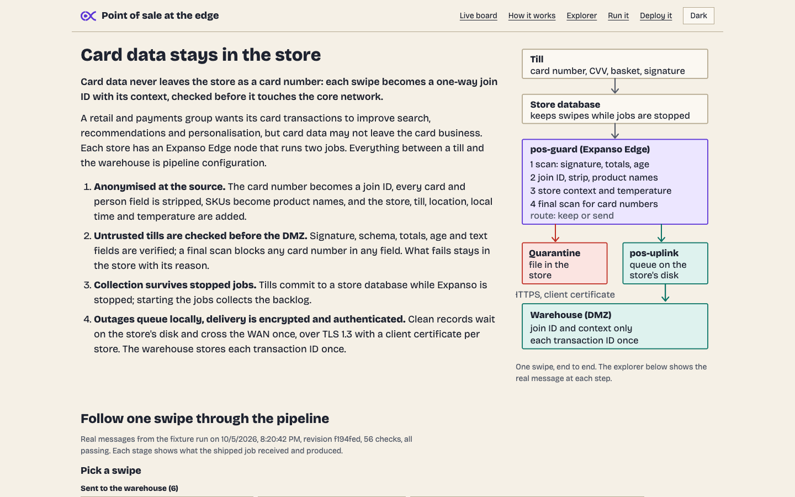

# Card data stays in the store

**Card data never leaves the store as a card number: each swipe becomes a
one-way join ID with its context, checked before it touches the core
network.**

A retail and payments group wants its card transactions to improve online
search, recommendations and personalisation, but card data may not leave
the card business. This demo runs four stores with twelve tills, an Expanso
Edge node in each store, and a warehouse behind the DMZ, and shows:

1. **Anonymised at the source.** Tills emit what a terminal prints: full
   card number, track 2, CVV, expiry, cardholder, operator code and SKU
   lines. Each store's node turns the card number into a join ID
   (HMAC-SHA256, algorithm `jid1`, one key for the group), strips every
   card and person field, resolves SKUs to product names and categories
   from the catalog, and adds store, till, location, local time and the
   store's temperature.
2. **Untrusted tills are checked before the DMZ.** Every swipe's signature,
   schema, totals and text fields are verified at the store; a final scan
   blocks any card number in any field. What fails stays in the store with
   its reason.
3. **Collection survives stopped jobs.** Tills commit to a store database
   while Expanso is stopped. Starting the jobs collects the backlog; the
   warehouse feed shows received records and opens their JSON on click.
4. **Network outages queue locally, and the WAN leg is encrypted and
   authenticated.** Drop a store's network: clean records wait on the store's
   disk and drain when it returns. Delivery is at least once over TLS 1.3 with
   a client certificate per store; the warehouse deduplicates transaction IDs
   and refuses a batch that carries another store's records.
5. **Each store's window display** shows the top seller of the last
   10-second sales window and any silent till, computed by the same job.


## Follow one swipe

[`dashboard/explorer.html`](dashboard/explorer.html) (open it from the board's
**Step explorer** link, or at `http://localhost:8640/explorer.html`) walks a
swipe through raw swipe, scan, join ID and strip, store context, final scan
with quarantine or uplink, and the warehouse receipt. Every input and output
on it is a real message recorded from the shipped jobs running on Expanso Edge
nodes ([`dashboard/data/stages.json`](dashboard/data/stages.json)), for 14
fixture swipes: 6 that reach the warehouse and 8 faults that stay in the store.
Left and Right page the stages without moving the page; every copy and
download says whether it worked. The page also carries the run and deploy
instructions, including the environment each job reads.



## How it works

```
 store N (x4)                                         core network (DMZ)
 tills --> store SQLite --> pos-guard --> pos-uplink -- WAN --> warehouse
 sensor, heartbeats -->       |  scan, join ID, strip,     (SQLite + API)
                              |  context, card-number block
                              +--> quarantine file (stays in the store)
       both jobs deployed from Expanso Cloud, selector role=pos-store
```

Everything between a till and the warehouse is pipeline config:

- [`pipelines/pos-guard.yaml`](pipelines/pos-guard.yaml): `http_client`
  inputs that pull the store database and separate telemetry endpoint, signature check with
  `hash("hmac_sha256")`, schema, range and injection checks, the join ID,
  field stripping, store context, the store temperature from a `memory`
  cache fed by the sensor, a `collapse`-based card-number block, a
  silent-till roster on a 5-second timer, a 10-second sales window for the
  store display, and a `switch` output to the quarantine file, the uplink and
  the display.
- [`pipelines/pos-uplink.yaml`](pipelines/pos-uplink.yaml): a `sqlite`
  buffer on the store's disk, and a `retry` output that holds a failed batch
  instead of handing it back. The output is HTTPS only (the URL is literally
  `https://`), trusts only the group's CA, and presents the store's client
  certificate. Warehouse transaction IDs deduplicate retries.

Custom code is only the stores (tills, sensors, window displays and WAN
links, [`scripts/stores.py`](scripts/stores.py)), the warehouse sink
([`scripts/warehouse.py`](scripts/warehouse.py), TLS 1.3 with a required
client certificate; [`scripts/pki.py`](scripts/pki.py) issues them) and the board
([`scripts/dashboard.py`](scripts/dashboard.py), [`dashboard/`](dashboard/)).
The central side's online profiles are join IDs computed by its own
implementation of `jid1`; the match count shows both sides agree.

## Run it

Prerequisites: `just`, `uv`, `jq`, `curl`, `openssl`, `expanso-edge` and
`expanso-cli`.

```bash
cp env.example .env && chmod 600 .env   # add the three EXPANSO_ values
just up          # Cloud jobs stopped; nodes connected
open http://localhost:8640
# start pos-guard and pos-uplink in the Expanso Cloud console
just down        # stop everything and stop the jobs in Cloud
```

`just up-local` runs the same jobs on a local control plane per node with
no Cloud account and starts them at once; the board says which mode is
live. `just start-jobs` starts both jobs in Cloud from the terminal.

Presenter keys on the board: `1`-`4` or Left and Right pick a store, `t` tamper, `l` card
number in a note, `m` malformed, `i` injection, `x` crash a till, `s`
sensor, `n` network, `a` automatic cycle, `r` reset, `p` key bar, `d` dark.
Clicking a till switches it on or off. The same controls are `just cut`,
`just fault`, `just sensor-off` and friends. The board binds to localhost
only and never deploys, starts or stops a job.

`just check` runs the offline tests (including the negative WAN tests that
prove plaintext, unauthenticated and cross-store delivery fail), pipeline
validation and lint, the video-strict UI lint, the JS anti-slop gate and the
prohibited-word scan. With the board up, `just ui-audit` measures page width
and text contrast in a real browser at 320, 400, 768 and 1440 px in light and
dark, with every fault injected and the record dialog open, and tests arrow-key
paging and copy feedback on the explorer.

## Prove it

`just proof` runs both shipped jobs on two real Expanso Edge nodes against the
14 fixture swipes, with a wrong-authority certificate, a cut link and a node
restart on the way, and checks the warehouse, quarantine files, window display
and register roster against expectations computed independently in
[`scripts/fixtures.py`](scripts/fixtures.py). It writes a dated report, the
latest of which is
[`docs/proof/latest.json`](docs/proof/latest.json) (report named inside), and
refreshes the explorer's data. `just test` fails when the jobs, fixtures or the
code they exercise change without a new proof, so the report always describes
the revision it sits in. The run has already found real defects: a swipe from
an unenrolled register that was never acknowledged, and a warehouse scan that
mistook digits inside a join ID for a card number.

## The public bar

The shared check (`.demo-kit/public-bar.py`, vendored from the demo kit, run by
`.github/workflows/public-bar.yml` on every push) holds this repository to five
criteria: both jobs validate and replay on Expanso Edge from fixtures
(`fixtures/replay`), the platform claims are declared and evidenced
([`docs/security-evidence.md`](docs/security-evidence.md)), the explorer page has its explanation,
stages, run and deploy sections, the pages pass a rendered width, contrast and
keyboard audit in a real browser, and no retained feature in
[`public-features.json`](public-features.json) can disappear without a recorded approval.
`just public-bar` runs the static lane locally; `just public-bar all` adds the browser.
The jobs read store configuration from `POS_CONFIG_DIR` files, so the replay
runs from a checkout with no environment.

[`docs/feature-history.json`](docs/feature-history.json) lists every board and pipeline
feature earlier revisions had, and what became of each; `just test` fails if a
retained feature disappears.

## Measured

Fixture run, 2026-10-05, two Expanso Edge nodes, both jobs: 14 swipes in, 6
records in the warehouse, 8 kept in the store with their reasons, 0 card
numbers in any quarantine record or warehouse row, 0 duplicates after an
outage that held all 6 queued records through a node restart. The wrong
certificate delivered nothing: the warehouse refused every connection and the
records stayed on disk. Full detail in the latest report under `docs/proof/`.

On Expanso Cloud with the first build (2026-10-01, four nodes, before the
durable store database): after a 30 s drop at Riverside its queue held 9
records and drained to 0 with no duplicates; a longer drop later queued 123
and drained the same way. Over 1,483 warehouse records: 0 card numbers, 0
duplicates, 200 shoppers seen in more than one store, 171 of 177 online
profiles joined by join ID.

## Troubleshooting

- **`up` refuses: active jobs with no node selector.** Another demo's job
  would land on the store nodes. Stop it or use a dedicated workspace;
  `just up-local` works meanwhile.
- **`expanso-cli job logs` fails with "bad handshake".** Seen on every job
  in the shared workspace on 2026-10-01, not only these. The node writes
  the lines; check the Logs view in the Cloud console.
- **The board stays grey after starting the jobs.** It shows what Cloud
  reports, every 3 s; `/api/state` carries any Cloud error under `cloud`.

Store events are committed to `.runtime/store-events.db` even with both
Cloud jobs stopped. `pos-guard` polls the store API, processes each leased
record, and acknowledges it only after its output succeeds. Clean output
is accepted by the durable uplink queue; quarantine remains in the store.
An interrupted lease becomes available after 60 seconds. Delivery is at
least once, and the warehouse deduplicates transaction IDs. Raw history
remains available to the store database inspector after collection.

The source records their capture time. The signature and 120-second age
check compare the signed event time with that capture time, so an old
backlog remains valid while records already stale on arrival are rejected.
Sale date and time come from the signed transaction, even during a later
drain. Temperature is the latest reading at collection; `sensor_at` records
its source timestamp. Telemetry follows its own polling endpoint;
polling a silent device does not make its readings fresh.

`just up` is an explicit clean start and clears source history. Restarting
only the stores process preserves the database and its pending events.
