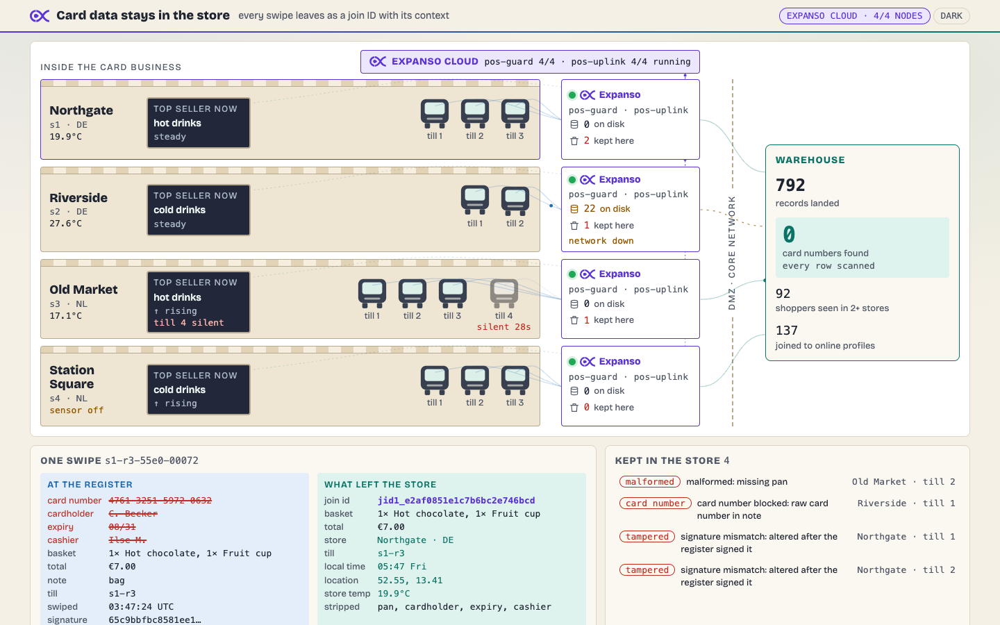
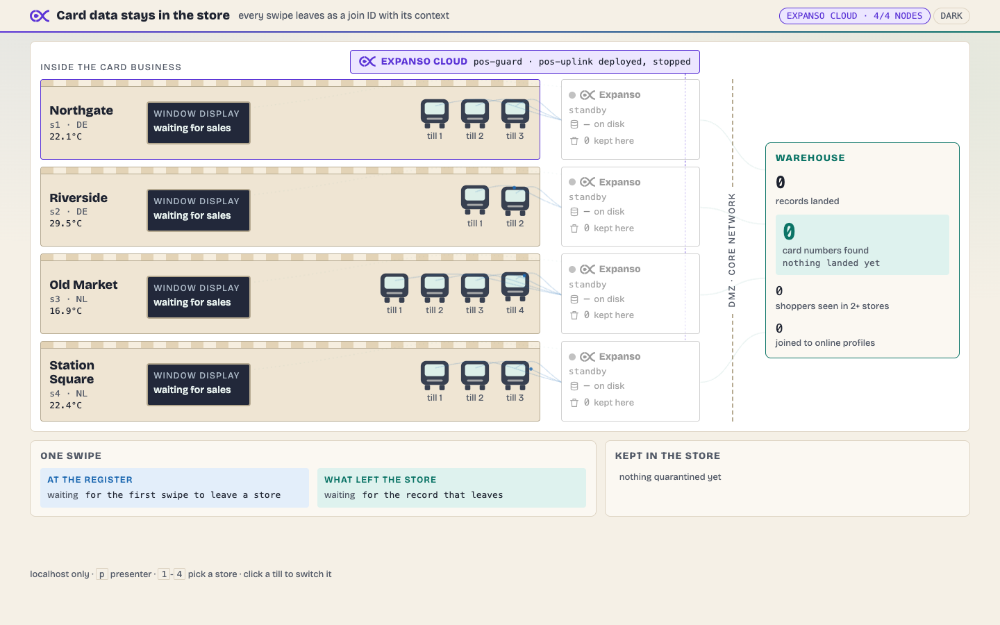

# Card data stays in the store

**Card data never leaves the store as a card number: each swipe becomes a
one-way join ID with its context, checked before it touches the core
network.**

A retail and payments group wants its card transactions to improve online
search, recommendations and personalisation, but card data may not leave
the card business. This demo runs four stores with twelve tills, an Expanso
Edge node in each store, and a warehouse behind the DMZ, and shows:

1. **Anonymised at the source.** Each store's node turns the card number
   into a join ID (HMAC-SHA256, algorithm `jid1`, one key for the group),
   strips cardholder, expiry, cashier and loyalty email, and adds store,
   till, location, local time and the store's temperature.
2. **Untrusted tills are checked before the DMZ.** Every swipe's signature,
   schema, totals and text fields are verified at the store; a final scan
   blocks any card number in any field. What fails stays in the store with
   its reason.
3. **Results go both ways.** Clean records go to the warehouse; each store's
   window display gets a 10-second sales window from its own node.
4. **Nothing is lost.** Drop a store's network: its records wait on the
   store's disk and drain once each when it returns.





## How it works

```
 store N (x4)                                         core network (DMZ)
 tills -- signed swipe --> pos-guard --> pos-uplink -- WAN --> warehouse
 sensor, heartbeats -->       |  scan, join ID, strip,     (SQLite + API)
                              |  context, card-number block
                              +--> quarantine file (stays in the store)
                              +--> window display (10 s sales window)
       both jobs deployed from Expanso Cloud, selector role=pos-store
```

Everything between a till and the warehouse is pipeline config:

- [`pipelines/pos-guard.yaml`](pipelines/pos-guard.yaml): `http_server`
  inputs for swipes and store telemetry, signature check with
  `hash("hmac_sha256")`, schema, range and injection checks, the join ID,
  field stripping, store context, the store temperature from a `memory`
  cache fed by the sensor, a `collapse`-based card-number block, a
  silent-till roster on a 5-second timer, and a `switch` output to the
  quarantine file, the uplink and the window display.
- [`pipelines/pos-uplink.yaml`](pipelines/pos-uplink.yaml): a `sqlite`
  buffer on the store's disk, and a `retry` output that holds a failed batch
  instead of handing it back, so each record crosses the WAN once.

Custom code is only the stores (tills, sensors, window displays and WAN
links, [`scripts/stores.py`](scripts/stores.py)), the warehouse sink
([`scripts/warehouse.py`](scripts/warehouse.py)) and the board
([`scripts/dashboard.py`](scripts/dashboard.py), [`dashboard/`](dashboard/)).
The central side's online profiles are join IDs computed by its own
implementation of `jid1`; the match count shows both sides agree.

## Run it

Prerequisites: `just`, `uv`, `jq`, `curl`, `openssl`, `expanso-edge` and
`expanso-cli`.

```bash
cp env.example .env && chmod 600 .env   # add the three EXPANSO_ values
just up          # Expanso Cloud: jobs deployed and stopped, nodes connected
open http://localhost:8023
# start pos-guard and pos-uplink in the Expanso Cloud console
just down        # stop everything and stop the jobs in Cloud
```

`just up-local` runs the same jobs on a local control plane per node with
no Cloud account and starts them at once; the board says which mode is
live. `just start-jobs` starts both jobs in Cloud from the terminal.

Presenter keys on the board: `1`-`4` pick a store, `t` tamper, `l` card
number in a note, `m` malformed, `i` injection, `x` crash a till, `s`
sensor, `n` network, `a` automatic cycle, `r` reset, `p` key bar, `d` dark.
Clicking a till switches it on or off. The same controls are `just cut`,
`just fault`, `just sensor-off` and friends. The board binds to localhost
only and never deploys, starts or stops a job.

`just check` runs the offline tests, pipeline validation and lint, the
video-strict UI lint, the JS anti-slop gate and the prohibited-word scan.

## Measured

On Expanso Cloud (2026-10-01, four nodes, both jobs running): after a 30 s
drop at Riverside its queue held 9 records and drained to 0 with no
duplicates; a longer drop later queued 123 and drained the same way. Over
1,483 warehouse records: **0 card numbers** found by the warehouse's own
scan, 0 duplicates, 200 shoppers seen in more than one store, 171 of 177
online profiles joined by join ID. Both jobs read Running, not Degraded,
throughout.

## Troubleshooting

- **`up` refuses: active jobs with no node selector.** Another demo's job
  would land on the store nodes. Stop it or use a dedicated workspace;
  `just up-local` works meanwhile.
- **`expanso-cli job logs` fails with "bad handshake".** Seen on every job
  in the shared workspace on 2026-10-01, not only these. The node writes
  the lines; check the Logs view in the Cloud console.
- **The board stays grey after starting the jobs.** It shows what Cloud
  reports, every 3 s; `/api/state` carries any Cloud error under `cloud`.
